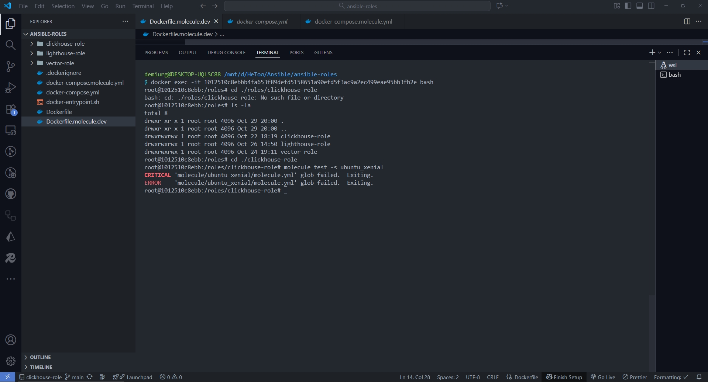
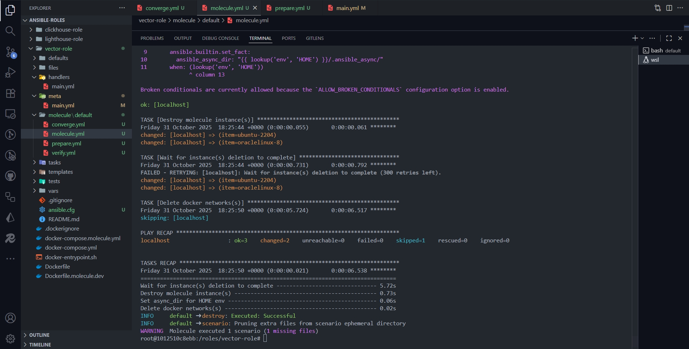
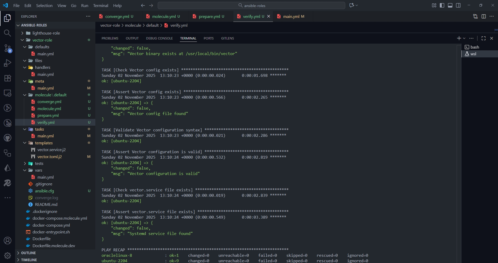
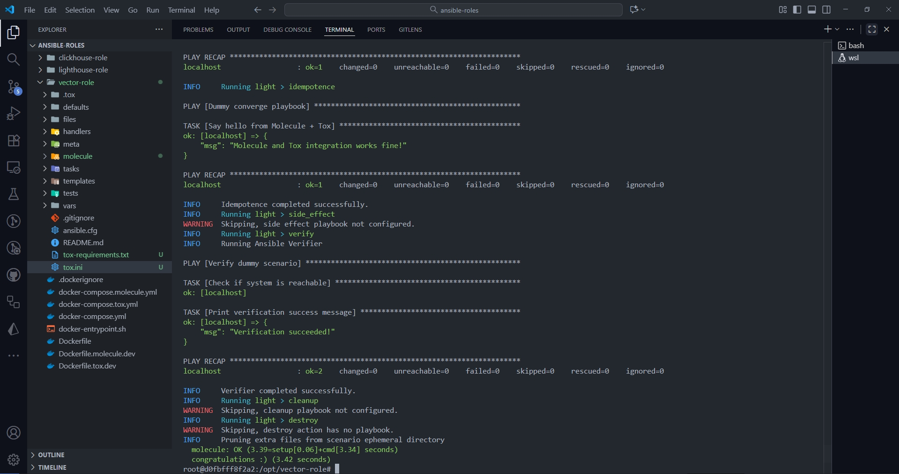

# Отсутствие молекулы.

# Успешное тестирование средствами молекулы.

# Добавление проверок в verify.yml, и успешное их прохождение.

# Автоматизация тестирования molecule с помощью tox.

По tox нужно дать пояснение.

- Поскольку я всю работу проводил из docker контейнера (система windows с wsl, поэтому не устанавливал ansible на host), который не позволяет podman добраться до ядра и получить доступ к созданию сетевых ресурсов, пришлось переделать легковесный сценарий тестирования под условную "заглушку" и драйвер default(ex delegate).
- Задача автоматизации запуска тестирования молекулой с помощью tox отработана. Так же, задача отработана на python:3.9. На старших версиях не представляется возможным отработать настоящую роль (не заглушку), потому что она вся писалась под версии >=3.9. По крайней мере с такими временными рамками.
- Так же в файле tox.ini не подключаются
